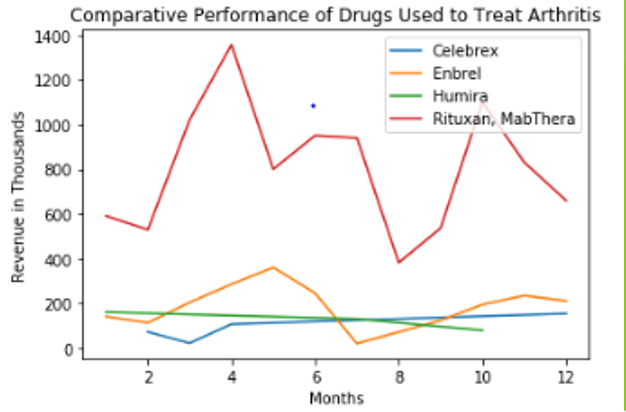
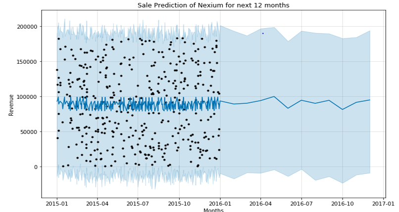
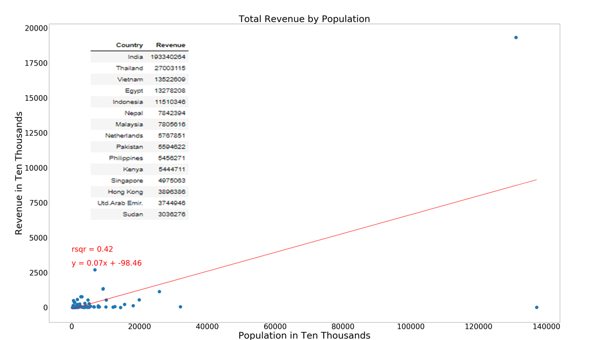
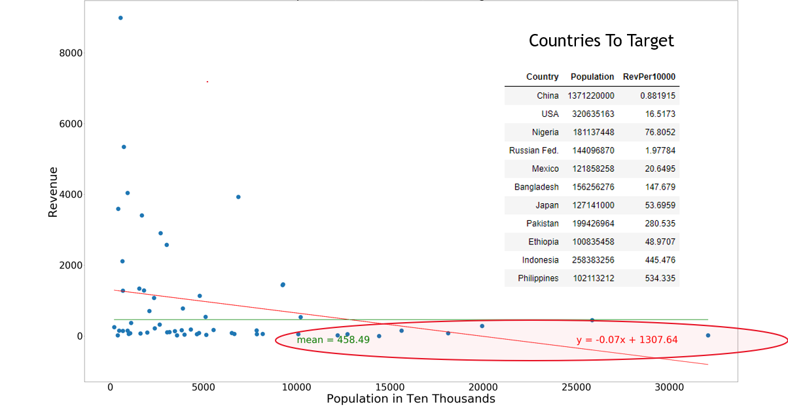

# US Pharmaceutical Business Data Analysis and Prediction
The project, completed by a team of four,  to analyse a sample dataset of Offshore business by US based Pharmaceutical Companies for 2015 and assist in decision making . The dataset contains 3326 rows and 16 columns.

## Team Members
* Akshita Parasrampuria
* Nick VanLangen
* Padmini
* Tamala Chipeta

## Narrative
* To analyse the business of pharmaceutical industry players and understand competition amongst them.
* Past performance of each drug to understand their prospect for the coming year.
* Predicting sales for a product for the coming year to budget demand based on past year's trend (Time Series Analysis)
* Potential Markets for growing business
* Helping in capital budgeting decisions like a cost benefit analysis of building a plant in the middle of the market to save on transportation costs.

## Data Source
Our dataset, Pharmaceutical Business Dataset, was retrieved from [Kaggle](https://www.kaggle.com/mnshsh07/pharmaceutical-business-dataset)

## Tools and Tenchnologies used and Required to run the Project
* Python 3 Libraries: Pandas, Matplotlib, fbProphet, Json, Requests, Datetime, NumPy, SciPy, Gmaps, Warnings
* Prophet Model for Time Series Analysis
* GeoCode API
* World Bank API
* Jupyter Notebook
* Microsoft Powerpoint

## How to Run the Code
1. Download All the files from the repository or clone it.

2. Open Jupyter Notebook, Open Part 1, 2, 3 and 4, in that order.
3. Comment out last line in first cell and enter your GeoCode API key as g_key="YOUR KEY HERE"
4. Run all the files. This will run all the cells on the page and display all the dataframes and graphs.
5. Alternatively, you can also download the Project.pptx and see the whole process and output of the Project  

## Our Findings
* Heatmap based on Revenue: 
This image displays the top regions that bring in the most revenue. This can be a major help in several decision making factors such as aiding in the cost benefit analysis of building a plant in the most marketable areas like South Asia and the Middle East to save on transportation costs.

### Revenue & Quantity by Drugs:
Here we have a comparison on revenue and quantity of the drugs sold. Because only looking at sales can depict misleading results like in the case of Copaxone, we wanted to see how other medications compaired. Back to our example of Copaxone, it is higher than Avastin in terms of revenue but there was a higher quantity of Avastin sold. Because of this, we concluded that the company selling Avastin, Genentech Inc., is likely generating more business than Teva Pharma., the company selling Copaxone. Medication need can also be another factor since Avastin has the ability to treat a range of cancers while Copaxone only treats multiple sclerosis. We also noticed that Lyrica, manufactured by Pfizer, sold more than it's competitors while also generating the most revenue. This could mean that this is the most popular drug for nerve/muscle pain and the most expensive.

 ### Company Revenue Shares:
 We see here that Pfizer overwhelmingly makes the most revenue followed by companies that sell generic medications. This information brings to light the concern that there aren't enough available generic medicaitons in the market. Because of this, it could be a good incentive to branch out more on this venture.

Since Pfizer was clearly an outlier and this data included generic as one commpany, we created another pie chart excluding those two outliers in order to have a better picture of the other companies' revenue shar.

We can now see in this edited pie chart that Sanofi-Aventis is the company with the second highest revenue followed by Genentech/Roche and Centocor Ortho Biotech(now known as Janssen Pharmaceuticals, Inc.). This finding coincides with the fact at these companies sell about 73, 40, and 51 drugs at least in the United States. More information would need to be gathered on their global impact.

### Drug Performance throughout the Year:
Here we provided a summarised view of some of the drugs sold throughout the year. We wanted to show a quick glance of how the drugs have done so far. As shown below we can see what their prospects look like for the future, where the comapnies should increase investments, and which ones they should potentially withdraw from the market after additional cost-benefit analysis in order to prepare next year's budget. 

As you can see, Crestor has strong potential to do well in the comming years followed by Celebrex and potentially Atripia. Copaxone, a drug mentioned previously, also displays potential growth following the three drugs just mentioned. 

We also noticed a number of medications that had more sporadic predictions which included Lyrica's potential performance. Seeing Lyrica's performance was interesting compared to the previous graphs which displayed it's large revenue production. This could be the same for the multiple drugs similar to Lyrica such as Lantus Solostar and Spiriva.

Some medications' performances that are potentially on a severe decline are Humira, Abilify, Remicade and Cymbalta. There are other medications that seem to be in similar danger such as Nexium, Lantus, OxyContin, and Neulasta. 

If more time allowed, it would be interesting to see if all these predictions were true with additional research. Especially considering that this dataset was from 2015.  

### Drug Comparative Performance to Treat Arthritis:
* Comparative Performance of Drugs used to Treat a common disease "Arthritis" because drugs cannot be compared unless their target treatment is common.
(Can be checked for any other disease too just by changing the name of the disease)

###
* Sale Prediction of a drug "Nexium" for the next year using Facebook's Prophet Model. The black dots are actual data points and the deep blue line is the forecast.
(Can be checked for any other drug too just by changing the name of the drug)

### Monthly Sales forecast of the Drug

 
 ###
 * Spread comparison of each country to compare that even though size of Revenue of a country is higher than the other, the diversity of products imported maybe better for the other. 

 

###
 *  Revenue Per 10,000 Capita of Countries because even though revenue from India was highest, when compared to its population, it shows there is a lot of potential and similarly for Singapore, even though in terms of revenue it ranks 12th, in terms of per capita Revenue it ranks first.  

 

###
 * Countries that have scope for Sales.
 
 

###
* Potential Revenue from each country based on population by calculating gap from revenue per capita's mean. However, there are limitations in determining potential that should be considered like Political impacts, Trade Policies, Sanctions, Domestic Availability.

###
* Map with markers indicating Country and Revenue for the year. 

## Limitations
* This dataset only provided one year's worth of pharmaceutical revenue back in...
* 

## References
Companies Mentioned:
* Sanofi
* Genentech, Inc.
* Janseen Phamra(formerly known as )

Drugs Mentioned: 
