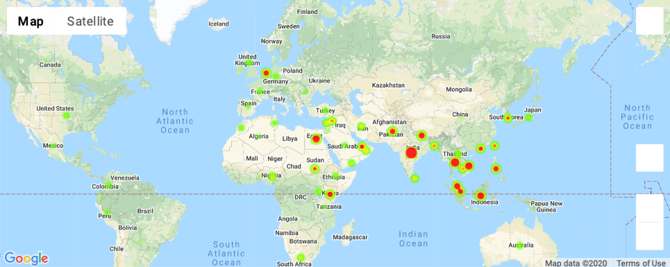
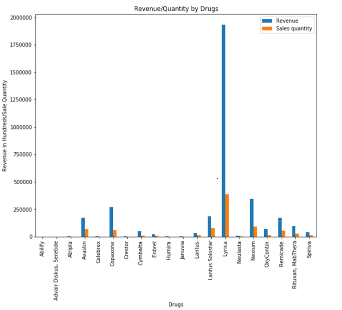
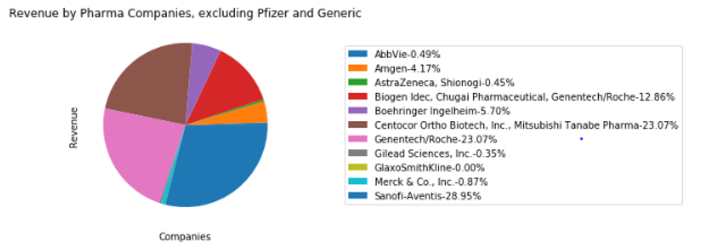
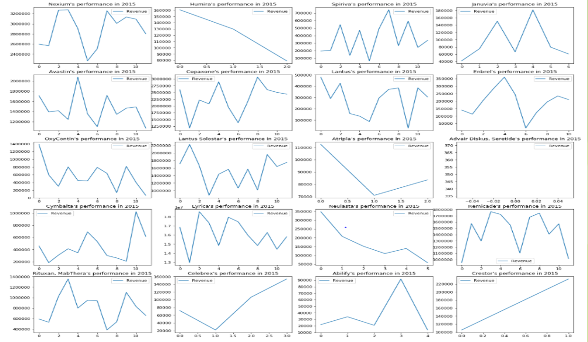
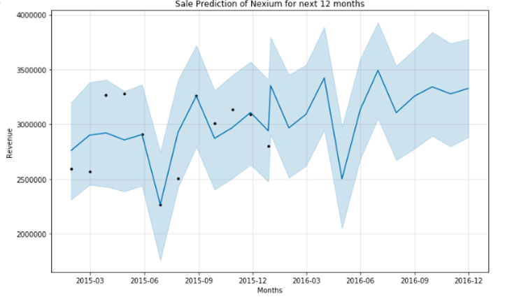
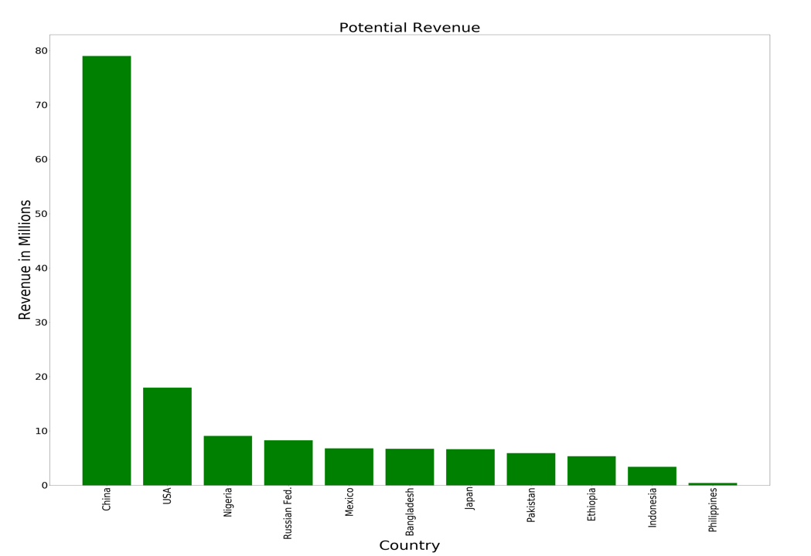
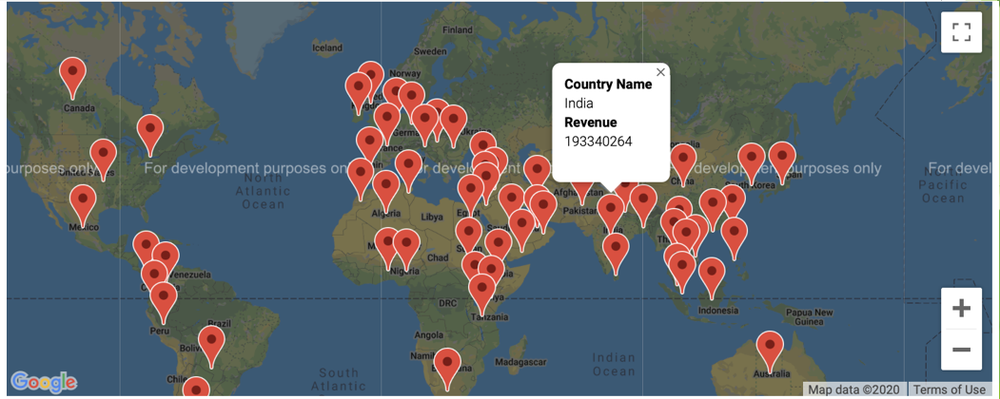

# US Pharmaceutical Business Data Analysis and Prediction
The project, completed by a team of four,  to analyse a sample dataset of Offshore business by US based Pharmaceutical Companies for 2015 and assist in decision making . The dataset contains 3326 rows and 16 columns.

## Team Members
* Akshita Parasrampuria
* Nick VanLangen
* Padmini
* Tamala Chipeta

## Narrative
* To analyse the business of pharmaceutical industry players and understand competition amongst them.
* Past performance of each drug to understand their prospect for the coming year.
* Predicting sales for a product for the coming year to budget demand based on past year's trend (Time Series Analysis)
* Potential Markets for growing business
* Helping in capital budgeting decisions like a cost benefit analysis of building a plant in the middle of the market to save on transportation costs.

## Data Source
[Kaggle](https://www.kaggle.com/mnshsh07/pharmaceutical-business-dataset)

## Tools and Tenchnologies used and Required to run the Project
* Python 3
	* Libraries:- Pandas, Matplotlib, fbProphet, Json, Requests, Datetime, NumPy, SciPy, Gmaps, Warnings
* Prophet Model for Time Series Analysis
* GeoCode API
* World Bank API
* Jupyter Notebook
* Microsoft Powerpoint

## How to Run the Code
1. Download All the files from the repository or clone it.

2. Open Jupyter Notebook, Open Part 1, 2, 3 and 4, in that order.
3. Comment out last line in first cell and enter your GeoCode API key as g_key="YOUR KEY HERE"
4. Run all the files. This will run all the cells on the page and display all the dataframes and graphs.
5. Alternatively, you can also download the Project.pptx and see the whole process and output of the Project  

## Output
* Heatmap based on Revenue that shows the major region of revenue that can help in several decision making, for example:- doing a cost benefit analysis of building a plant in the middle of the market to save on transportation costs as major sales are in South Asia and Middle East. 

 * Revenue and Quantity sold of each drug because only looking at sales can depict misleading results like in the case of Copaxone, in terms of revenue it is higher than Avastin, but Avastin sold more quantity, so in real sense it is doing more business than Copaxone.

 * Revenue Share of each company.

But it was noticed that Pfizer was clearly an outlier and that it also included generic which is not a commpany but a group of generic companies, so a plot was made excluding the two to have a better picture of the rest.

* Summarised view of Performance of each Drug throughout the year. This group of plots can, with just a glance, show how the drugs have done so far and what their prospect looks like for the future, where the comapnies should invest more and which are the ones that they should not count on or maybe withdraw from the market after a cost benefit analysis, while preparing budget for the next year. 

* Comparative Performance of Drugs used to Treat a common disease "Arthritis" because drugs cannot be compared unless their target treatment is common.
(Can be checked for any other disease too just by changing the name of the disease)

* Sale Prediction of a drug "Nexium" for the next year using Facebook's Prophet Model. The black dots are actual data points and the deep blue line is the forecast.
(Can be checked for any other drug too just by changing the name of the drug)

Monthly Sales forecast of the Drug

 
 * Spread comparison of each country to compare that even though size of Revenue of a country is higher than the other, the diversity of products imported maybe better for the other. 

 

 *  Revenue Per 10,000 Capita of Countries because even though revenue from India was highest, when compared to its population, it shows there is a lot of potential and similarly for Singapore, even though in terms of revenue it ranks 12th, in terms of per capita Revenue it ranks first.  

 

 * Countries that have scope for Sales.
 
 

* Potential Revenue from each country based on population by calculating gap from revenue per capita's mean. However, there are limitations in determining potential that should be considered like Political impacts, Trade Policies, Sanctions, Domestic Availability.

* Map with markers indicating Country and Revenue for the year. 

